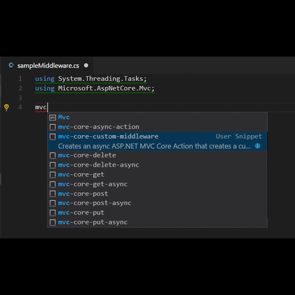

## Snippet bundle for asp.net core extension.

This is a collection of asp.net core snippets for Visual Studio Code. It includes asp.net core, razor, appsettings, C# and other associated snippets required for complete asp.net core development.

## Features

A set of snippets including:

|  Controller Snippet                               |  
|  Command--> HomeController                        |  

|  Program File Snippet                             |  
|  Command--> ProgramFile                           |  
|  Command--> ProgramFile-Full                      |  

|  Startup File Snippet                             |  
|  Command--> startup                               |  

|  MVC Action Snippets                              |  
|  Command--> mvc-core-action                       |  
|  Command--> mvc-core-get                          |  
|  Command--> mvc-core-post                         |  
|  Command--> mvc-core-put                          |  
|  Command--> mvc-core-delete                       |  

|  MVC Async Action Snippets                        |  
|  Command--> mvc-core-async-action                 |  
|  Command--> mvc-core-get-async                    |  
|  Command--> mvc-core-post-async                   |  
|  Command--> mvc-core-put-async                    |  
|  Command--> mvc-core-delete-async                 |  

|  Middleware Snippets                              |  
|  Command--> mvc-core-custom-middleware            |  
|  Command--> middleware-interface                  |  

|  App Snippets                                     |  
|  Command--> app-use                               |  
|  Command--> app-run                               |  
|  Command--> app-use-defaultfiles                  |  
|  Command--> app-use-staticfiles                   |  
|  Command--> app-use-directory-browser             |  
|  Command--> app-connection-string                 |  
|  Command--> app-map                               |  
|  Command--> program-main                          |  
|  Command--> dbcontext-ef                          |  
|  Command--> dbContext-UseSqlServer                |  
|  Command--> dbContext-UseInMemoryDatabase         |  
|  Command--> services-add-mvc                      |  
|  Command--> services-add-mvc-json-converters      |  
|  Command--> services-add-mvc-json-options         |  
|  Command--> services-add-mvc-json-camel           |  
|  Command--> services-add-spastaticfiles           |  
|  Command--> services-add-transient-interface      |  
|  Command--> service-add-transient-with-class      |  
|  Command--> services-add-scoped                   |  
|  Command--> services-add-singleton                |  
|  Command--> services-add-singleton<T>             |  
|  Command--> services-add-singleton<I>(new T())    |  
|  Command--> services-add-singleton-factory        |  
|  Command--> app-use-spa                           |  
|  Command--> appsettings                           |  

## Razor Snippets                                   

As part of built in snippet bundle, razor is already supported by default in .cshtml pages. You just need to type starting @ and you will get all razor syntax with their usage.
   

## Installation

You can install the extension by visiting the store at:

- https://marketplace.visualstudio.com/items?itemName=rahulsahay.Csharp-ASPNETCore

Or just typing this command in Visual Studio Core:

    ext install Csharp-ASPNETCore
## Blog

You can also reach me at 

- http://myview.rahulnivi.net

